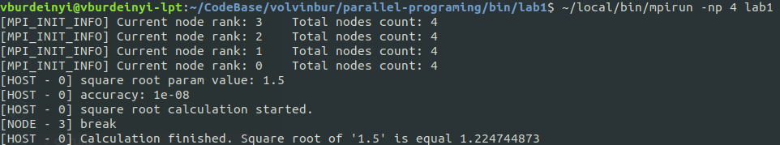
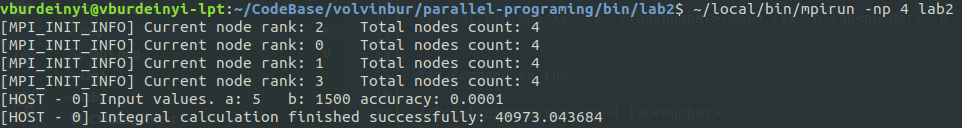

# Prallel programing
*Variant 3*

## Build and run
### Before building an running
```
cd bin/lab<number>
```

### Command to build
```
~/local/bin/mpicxx ../../lab<number>/main.cxx -o lab<number> -g
```

### Command to run
```
~/local/bin/mpirun -np 4 lab<number>
```

## Lab1
Square root calculation of x with accuracy 1e-8
### Input
```
1.5     // value under the square root
```
### Output
```
1.224744873
```


## Lab2
Integration of f(x) = log2(x^3) with accuracy 1e-4 using right rectangles method.
### Input
```
5       // a
1500    // b
0.0001  // accuracy
```
### Output
```
1.224744873
```
.
